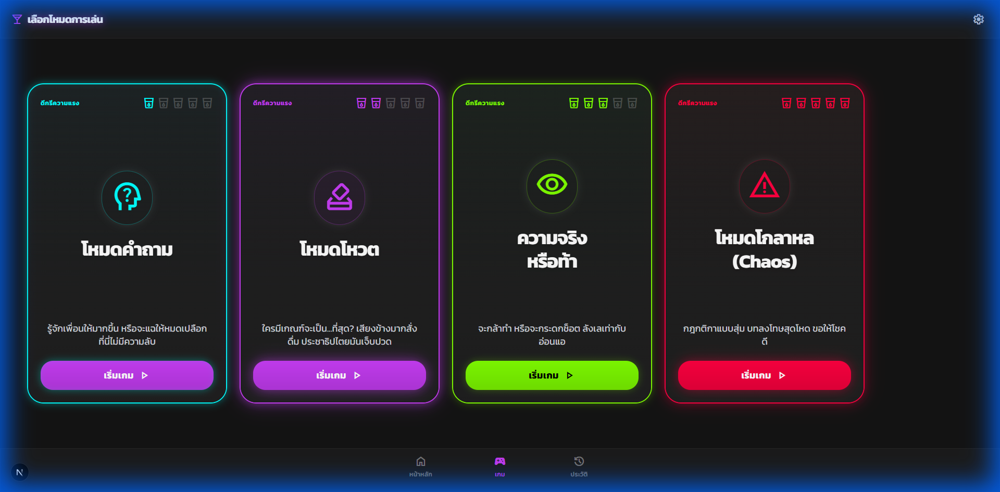
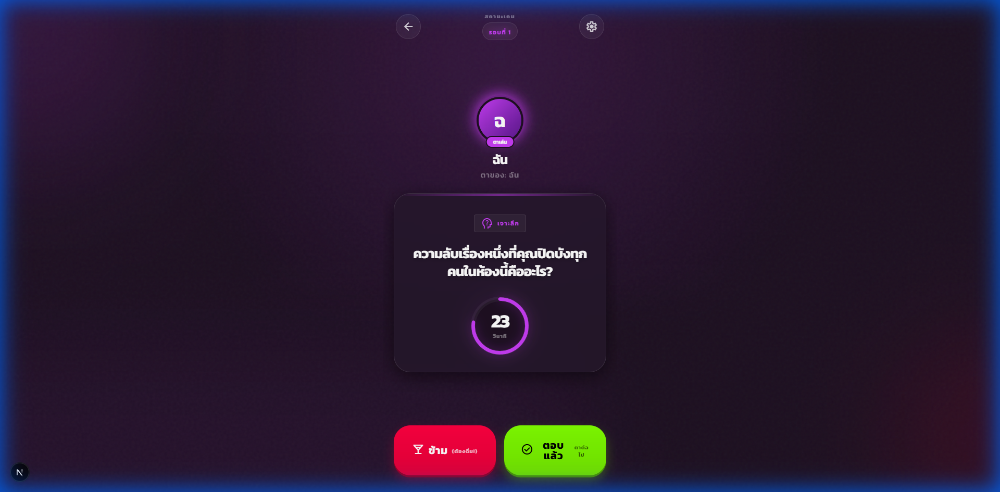
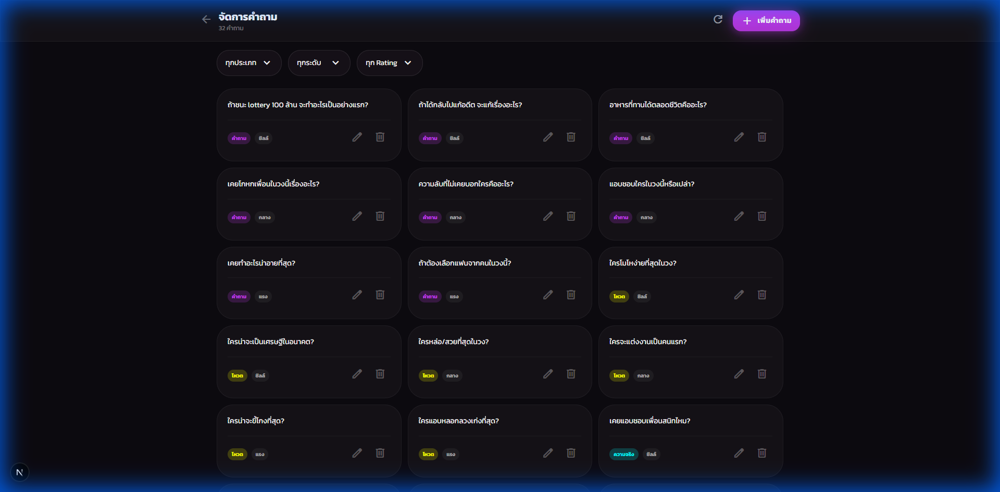

# วงแตก (Wong Taek) 🍻

เกมวงเหล้าสำหรับเพื่อนสนิท - เล่นบนมือถือหรือแท็บเล็ตเครื่องเดียวร่วมกัน

## Features

### สำหรับผู้เล่น

- **3 ระดับความเดือด**: ชิลล์ๆ 🧊, เริ่มเดือด 🍻, เดือดสุด 18+ 🔥
- **หลายโหมดเกม**: คำถาม, Truth or Dare, โหวต, โกลาหล
- **สุ่มคำถาม**: ไม่ซ้ำจนกว่าจะหมด pool
- **สุ่มผู้เล่น**: เปลี่ยนตาเล่นแบบ random ทุกรอบ
- **Timer**: นับถอยหลัง 30 วินาทีต่อรอบ
- **Settings**: เปิด/ปิด 18+ mode, เสียง, vibration

### Admin Panel

- **Dashboard**: ดูสถิติคำถามทั้งหมด
- **จัดการคำถาม**: เพิ่ม/แก้ไข/ลบ คำถาม
- **Filter**: กรองตามประเภท, ระดับ, 18+
- **Responsive**: ใช้งานได้ทั้ง Desktop และ Tablet

## Tech Stack

- **Framework**: Next.js 15 (App Router)
- **Styling**: Tailwind CSS + Custom CSS
- **Animation**: Framer Motion
- **State**: Zustand
- **Database**: Prisma + PostgreSQL (optional)
- **Icons**: Google Material Symbols

## Getting Started

```bash
# Install dependencies
npm install

# Run development server
npm run dev

# Build for production
npm run build

# Start production server
npm start
```

เปิด [http://localhost:3000](http://localhost:3000) เพื่อเริ่มเล่น

## Project Structure

```
src/
├── app/                  # Next.js App Router pages
│   ├── admin/           # Admin panel
│   │   ├── page.tsx     # Dashboard
│   │   └── questions/   # Question management
│   ├── game/            # Game pages
│   │   ├── modes/       # Mode selection
│   │   └── play/        # Gameplay
│   ├── lobby/           # Player setup
│   ├── settings/        # App settings
│   └── page.tsx         # Welcome page
├── components/          # Reusable UI components
│   └── ui/              # Button, Timer, GlassPanel, etc.
├── store/               # Zustand store
└── styles/              # Global CSS
```

## Environment Variables

```env
DATABASE_URL="postgresql://..."  # Optional, for real DB
```

## Screenshots

### Welcome Page

เลือกระดับความเดือดก่อนเริ่มเกม


### Game Modes

เลือกโหมดเกมที่ต้องการ: คำถาม, โหวต, Truth or Dare, โกลาหล



### Game Play

คำถามแบบ random พร้อม timer และปุ่ม ข้าม/ตอบแล้ว



### Admin Dashboard

จัดการคำถามทั้งหมดผ่าน web interface



## License

MIT License - ใช้งานได้ฟรี

---

**ดื่มอย่างรับผิดชอบ** 🍺
